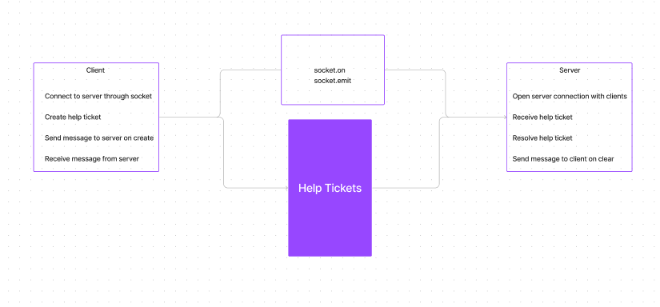

<!-- @format -->

# LAB - Class 14

## Project: Event Driven Programming Lab 14

With a team, an application that is well executed, planned, and presented must be created that showcases event driven architecture

### Author: Jacob Dang, Zoe Gonzalez, Lewis Benson

### Problem Domain  
  
Everyone needs help from time to time. Unfortunately REMO has been giving everyone difficulties. The help ticket system in this application solves the problem of not being able to submit a ticket when it is needed most.  
  
### Links & Resources  
  
{GitHub Actions} {URL}  
{Deployed Database} {}  
  
see '.env.sample'  
  
### Features/Routes:  
  
### How to run:  
  
This application requires 4 terminals. Use the following commands, one command per terminal:  
  
`node server/index.js` - This will open socket.io to listen for clients  
`node help/index.js` - This will prompt the user to look for new help tickets (if no tickets created it will return no tickets)  
`node client/index.js` - This will allow the client to view messages that come in from tech support  
`node client/newTicket.js` - This will allow the client to create new tickets  
  
- Client Handler: Creates and passes over 'tickets' that request for help with errors
- Helper Handler: Responds to 'tickets' and passes the tickets as 'received and fixed'

#### Tests  
  
- How do you run tests?  
  - node index.js  
  
## UML  
  
  
