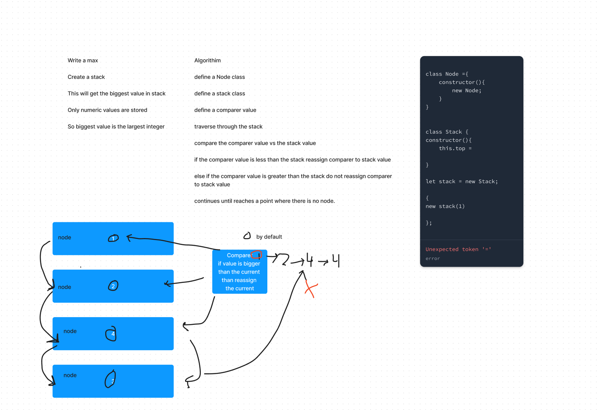

# LAB - Class 13

## Project: Event Driven Programming Lab 14
With a team, an application that is well executed, planned, and presented must be created that showcases event driven architecture

<<<<<<< HEAD
This application utlizes the usage of having sockets rather than eventbased Emitters, it is very useful and modularizes the program. It is between
=======

### Author: Jacob Dang
>>>>>>> 8072b73c4d5692c08d2d6d6423100e511e801a64

### Problem Domain
There must be a hub that connects and evaluates all events. Events connected to the hub must be seen within clients. The project must also operate over a network

<<<<<<< HEAD
Setup
=======
### Links & Resources
{GitHub Actions} {URL}
{Deployed Database} {}

see '.env.sample'
>>>>>>> 8072b73c4d5692c08d2d6d6423100e511e801a64

### Features/Routes:
- Client Handler: Creates and passes over 'tickets' that request for help with errors
- Helper Handler: Responds to 'tickets' and passes the tickets as 'received and fixed'

#### Tests
- How do you run tests?
    - node index.js

## UML

<<<<<<< HEAD
How to initalize application
'npm start'

'nodemon'

node ./driver/driverHandler.js

node ./vendor/vendor.js

'node server.js'

How to use your library
-nodemon for starting

-npm test for testing

Features / Routes
/ : automatically redirects you to the page.

/shoes all shoes

/shoes:id individual shoe association

/signin: allows user to sign into existing account

/signup: allows user to create an account

/users: lists users

/\* : If the page is not available then an error flag is thrown.

## Workflow

=======
>>>>>>> 8072b73c4d5692c08d2d6d6423100e511e801a64
